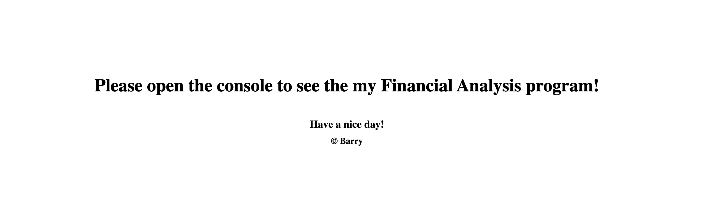

# Console Finances

## Description 

This webpage contains JavaScript logic to analyse the dataset which was provided. I have written the JavaScript code to fulfil the requirements that were outlined. It has been a great opportunity for me to apply the knowledge learned over the last week to instruct the computer to perform analysis on a dataset.

I've also gone slightly further to increase readibility of the console messages in two ways:
* Adding commas for large numbers.
    * (e.g. \$100,000,000 instead of $100000000).
* Ensuring that negative dollar values have their '-' sign before the dollar sign.
    * (e.g. -\$10,000 instead of \$-10,000)

Following this task, I've enhanced my skills to utilise JavaScript and the relevant methods to perform this Financial Analysis. I look forward to using and learning more JavaScript methods to perform my complex analysis and operations.

### Useful Links
[GitHub Repository: Console-Finances](https://github.com/barrylui88/04-Console-Finances/)

[Deployed Page (powered by GitHub Pages)](https://barrylui88.github.io/04-Console-Finances/)

## Installation

No installation is required - simply follow the URLs I have included above.

## Screenshots

### Full Webpage Screenshot
The webpage is basic, however it guides the user to open the console to see the Financial Analysis.

## License

MIT License

Copyright (c) 2023 Barry Lui

Permission is hereby granted, free of charge, to any person obtaining a copy
of this software and associated documentation files (the "Software"), to deal
in the Software without restriction, including without limitation the rights
to use, copy, modify, merge, publish, distribute, sublicense, and/or sell
copies of the Software, and to permit persons to whom the Software is
furnished to do so, subject to the following conditions:

The above copyright notice and this permission notice shall be included in all
copies or substantial portions of the Software.

THE SOFTWARE IS PROVIDED "AS IS", WITHOUT WARRANTY OF ANY KIND, EXPRESS OR
IMPLIED, INCLUDING BUT NOT LIMITED TO THE WARRANTIES OF MERCHANTABILITY,
FITNESS FOR A PARTICULAR PURPOSE AND NONINFRINGEMENT. IN NO EVENT SHALL THE
AUTHORS OR COPYRIGHT HOLDERS BE LIABLE FOR ANY CLAIM, DAMAGES OR OTHER
LIABILITY, WHETHER IN AN ACTION OF CONTRACT, TORT OR OTHERWISE, ARISING FROM,
OUT OF OR IN CONNECTION WITH THE SOFTWARE OR THE USE OR OTHER DEALINGS IN THE
SOFTWARE.